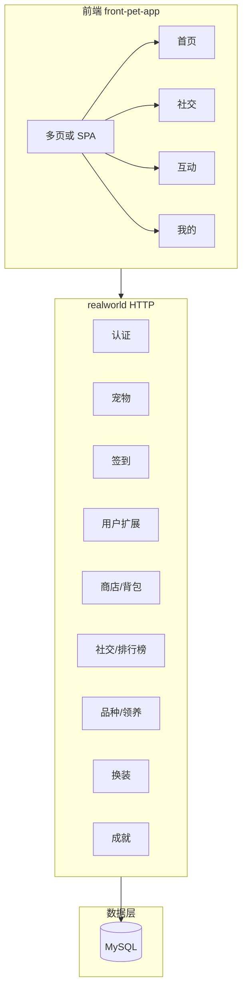

# 项目文档：萌宠之家（cat-admin）

## 1. 业务背景

萌宠之家是一款**云养宠伴侣**应用，核心体验为：

- 用户**领养**猫/狗宠物，在首页查看宠物状态与**成长数据**（饱食度、心情值、清洁度、亲密度）。
- 在**互动页**通过抚摸、逗猫棒、零食、洗澡等动作与宠物互动，提升亲密度与心情。
- 支持**每日签到**领取奖励；**商店**购买道具、**背包**使用道具（如喂食）；**领养**选择品种；**换装**为宠物搭配装扮。
- **社交**：好友列表、好友申请、排行榜；**个人中心**：资料编辑、金币与爱心积分、我的宠物、成就。

---

## 2. 目标与范围

- **原型依据**：code.html（萌宠之家 - 云养宠伴侣），React + Tailwind，底部 4 Tab：首页、社交、互动、我的。
- **前端**：在仓库根目录下新建 `front-pet-app`，与 `front-vue`、`front-xsh-admin` 并列；按原型实现全部页面与路由，视觉沿用 primary #ef3957、Plus Jakarta Sans、玻璃效果等。
- **后端**：在 realworld（Kratos）中新增宠物域及相关域：宠物与成长数据、互动、签到、用户资料与等级/金币/爱心积分、社交、商店与背包、领养与品种、换装、成就；可分期落地（先核心后扩展）。

---

## 3. 技术架构

- **前端**：静态或多页 + 原生 JS，或 React/Vue 单页；请求统一带 `Authorization: Bearer <token>`，Base URL 可配置（如 `http://localhost:8000`）。
- **后端**：realworld 单体，HTTP 服务注册各模块路由；JWT 鉴权（除登录/注册外）；GORM + MySQL，表结构见 [database/](database/)。

---

## 4. 模块与路由总览

| 模块 | 说明 | 主要路由/页面 |
|------|------|----------------|
| 首页 | 宠物卡片、成长数据、喂食/签到/商店/领养入口 | `/` |
| 互动 | 亲密度条、气泡文案、抚摸/逗猫棒/零食/洗澡 | `/interaction` |
| 社交 | 我的好友、排行榜、申请列表 | `/social`、`/ranking`、`/requests` |
| 我的 | 头像、昵称、等级、编辑资料、签到、金币/爱心、我的宠物 | `/profile`、`/edit-profile` |
| 商店 | 商品列表、购买、购买成功 | `/shop`、`/purchase-success` |
| 背包 | 物品列表、使用（喂食等） | `/inventory` |
| 领养 | 领养猫/狗、品种详情、选择品种 | `/adoption`、`/breed-detail` |
| 换装 | 头部/身体/颈部装扮、保存搭配 | `/dressup` |
| 成就 | 成就详情 | `/achievements` |

---

## 5. 实施顺序建议

1. 认证（沿用现有 auth）→ 宠物（含成长数据与互动）→ 签到  
2. 用户资料与金币/爱心积分 → 商店与背包 → 领养/品种 → 换装  
3. 社交（好友、申请、排行榜）→ 成就  

详细接口与表结构见 [02-后端开发文档.md](02-后端开发文档.md)、[03-前端开发文档.md](03-前端开发文档.md)、[database/](database/)。
