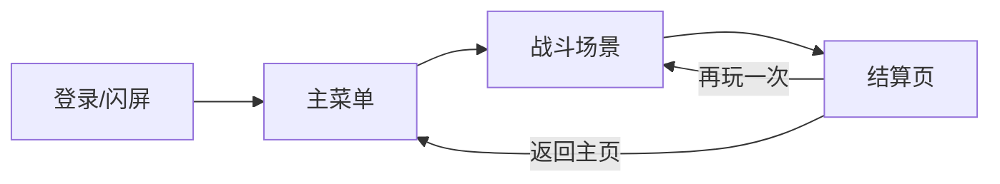
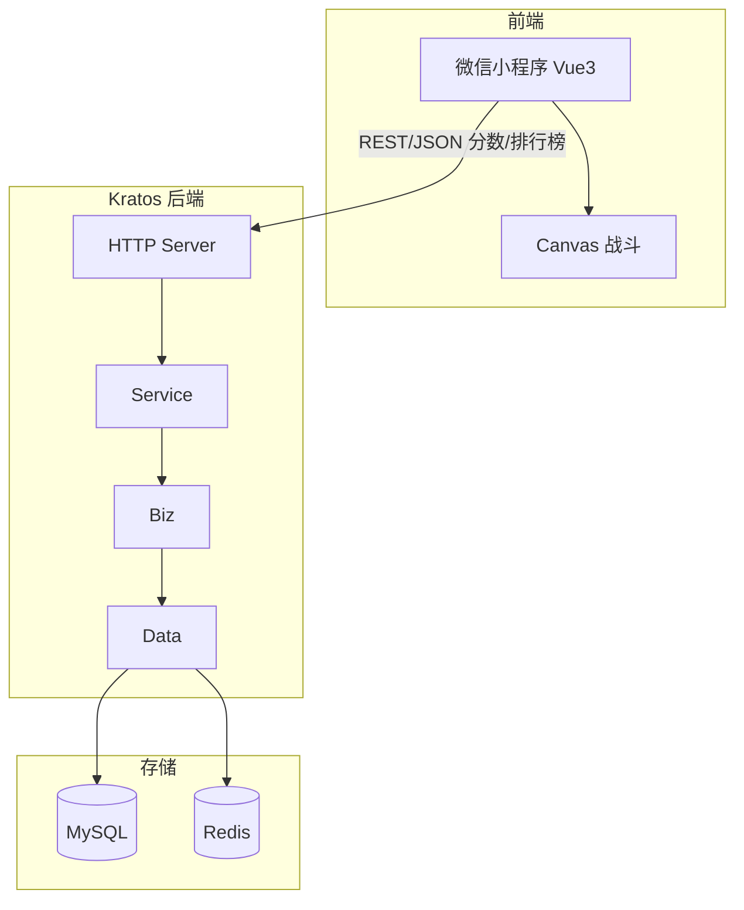

# 项目开发文档：防守割草小游戏

## 业务背景

防守割草是一款**防守类割草**微信小程序小游戏，核心体验为：

- 玩家站在**屏幕下方**防守，不断有「捣蛋小怪兽」从**上方**涌来。
- 玩家**自动发射星星子弹**净化怪兽，击败怪兽获得分数与能量。
- 能量积累到阈值时触发**升级**，游戏暂停并弹出**随机技能卡牌**（如增加弹道、星星弹射等），玩家选择后强化自身并继续游戏。
- 前端负责游戏逻辑与渲染，后端负责**数据存档**与**高并发**排行榜、分数上报。

---

## 核心页面流转

| 页面 | 说明 |
|------|------|
| 登录页 (Login/Splash) | 微信授权或闪屏，进入主菜单 |
| 主菜单 (Main Menu) | 入口页，开始游戏、排行榜、当前最高分 |
| 战斗场景 (Battle Canvas) | 游戏主玩法，HUD + Canvas + 升级弹窗 |
| 结算页 (Game Over) | 本局结果展示，上报分数，再玩一次/返回主页 |

---

## 界面设计说明

### 主菜单 (Main Menu)

- **游戏 Logo**
- **[开始游戏]** 按钮：进入战斗场景
- **[全服排行榜]** 按钮：跳转排行榜（或弹窗展示）
- **玩家当前最高分**：从后端拉取并展示，未登录时可显示「未登录」或占位

### 战斗场景 (Battle Canvas)

- **HUD（头部）**
  - 当前分数、当前等级
  - 暂停按钮（点击暂停游戏循环，可再继续）
- **游戏区（中央）**
  - 原生 Canvas 渲染
  - 玩家在**底部中央**固定位置
  - 怪兽从**顶部随机位置**向下移动
  - 星星子弹由玩家自动发射，与怪兽碰撞后净化并计分
- **升级面板（弹窗）**
  - 能量条满时触发，游戏**暂停**
  - 弹出 **3 张技能卡牌**，玩家点击其一获得能力
  - 关闭面板后继续游戏

### 结算页 (Game Over)

- **本次得分**、**生存波数**
- **[再玩一次]**：重新进入战斗场景
- **[返回主页]**：回到主菜单
- 进入结算页时**自动向后端提交本局分数**（用于更新最高分与排行榜）

---

## 技术架构

- **前端**：Vue3 微信小程序（uni-app 或 Taro），Canvas 负责战斗渲染与碰撞；通过 HTTP 调用 Kratos 提交分数、拉取排行榜与我的最高分。
- **后端**：在现有 realworld 项目中扩展，提供防守割草相关 API（提交分数、全服排行榜、我的最高分）；MySQL 存用户与分数记录，Redis 做排行榜缓存与高并发读写。
- **职责边界**：游戏逻辑（移动、碰撞、技能效果、能量与等级）全部在前端；后端只做存档、去重、排行榜与简单校验。

---

## 关键约束

- **前端负责**：游戏循环、实体（玩家/怪兽/子弹）、碰撞检测、技能效果、能量与升级逻辑、UI 与 HUD。
- **后端负责**：用户标识（如 openid）、分数上报与校验、最高分更新、全服排行榜、防作弊与频率限制（可选）。
- **微信登录/鉴权**：首期可采用匿名或 deviceId 占位；正式上线建议接入微信 code 换 openid/session，并在后端关联用户与分数。鉴权策略在 [02-backend.md](02-backend.md) 中说明。
