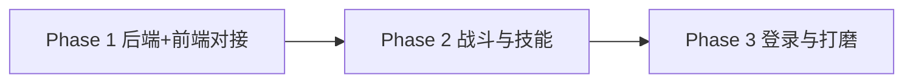

# 开发规划：防守割草小游戏

本文档约定开发阶段、里程碑与依赖关系，便于排期与评审。

---

## 阶段划分

### Phase 1：后端 API + 前端主流程与结算对接

- **后端**
  - 定义并实现防守割草 API：提交分数（SubmitScore）、全服排行榜（GetLeaderboard）、我的最高分（GetMyBest）。
  - 数据表与 Redis 排行榜设计落地（见 [02-backend.md](02-backend.md)）。
  - 首期可不接微信登录，使用匿名 id 或 deviceId 占位。
- **前端**
  - 主菜单页、结算页实现；主菜单拉取并展示「我的最高分」，结算页调用提交分数接口。
  - 排行榜页或弹窗：调用排行榜接口并展示列表。
- **验收**
  - 排行榜接口返回正确分页数据；主菜单能展示当前用户最高分（含匿名）；完成一局后进入结算页能成功上报分数并可在排行榜中体现。

### Phase 2：战斗场景与玩法

- **前端**
  - 战斗场景 Canvas：玩家（底部中央）、星星子弹（自动发射）、怪兽（顶部随机生成、下移）。
  - 碰撞检测、得分与能量增长、能量条满触发升级。
  - 升级面板：暂停游戏，展示 3 张技能卡，选择后应用技能并继续。
  - 实现至少 3 种以上技能（如增加弹道、星星弹射、伤害提升等）。
- **依赖**
  - 后端 Phase 1 已完成，前端可依赖真实接口或 mock。
- **验收**
  - 一局可完整打完（从主菜单进入战斗、升级选技能、死亡或通关后进入结算）；结算页显示本局得分与波数，并成功上报。

### Phase 3：登录与体验打磨

- **后端**
  - 微信登录接入：code 换 openid/session，用户与分数关联到真实用户。
- **前端**
  - 登录/授权流程，主菜单与排行榜展示昵称/头像（脱敏策略按产品要求）。
  - 排行榜展示优化、性能与体验打磨（帧率、手感、异常与重试提示）。
- **验收**
  - 微信授权后分数与排行榜正确关联；无明显卡顿与报错；关键操作可埋点（可选）。

---

## 里程碑汇总

| 阶段 | 里程碑 |
|------|--------|
| Phase 1 | 后端 3 个接口可用；前端主菜单、排行榜、结算页对接完成；能完成「上报分数 → 排行榜可见」闭环 |
| Phase 2 | 战斗场景可玩，升级与至少 3 种技能可用；一局完整流程跑通并上报 |
| Phase 3 | 微信登录接入；排行榜与主菜单展示优化；体验达标可发布 |

---

## 依赖关系

- 前端 Phase 1 依赖后端 API 约定（可先 mock，再切真实接口）。
- Phase 2 依赖 Phase 1 的提交分数与排行榜接口稳定。
- Phase 3 依赖 Phase 2 玩法闭环，再叠加登录与展示优化。

---

## 建议排期

- Phase 1：约 1–2 周（后端 proto + 表 + 接口 + 前端三页与对接）。
- Phase 2：约 2–3 周（Canvas 战斗、实体与碰撞、技能系统、升级面板）。
- Phase 3：约 1 周（微信登录、排行榜/主菜单优化、测试与修 bug）。

具体以团队人力与优先级为准；可先交付 Phase 1+2 做内部试玩，再推进 Phase 3。
