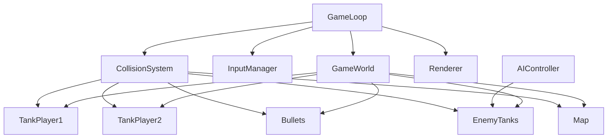

### 坦克大战核心游戏循环与对象模型

本文件定义坦克大战小游戏的核心游戏循环（Game Loop）以及关键对象模型，为前后端实现提供统一参考。

---

### 1. 核心游戏循环（Game Loop）

游戏采用经典的「更新（Update）+ 渲染（Render）」循环，目标帧率为 60 FPS（约 16.67ms 一帧）。

伪代码示意：

```ts
// GameLoop.ts（概念示例）
class GameLoop {
  init() {
    // 初始化地图、坦克、AI、输入系统等
  }

  start() {
    let lastTime = performance.now();
    const loop = (now: number) => {
      const dt = (now - lastTime) / 1000; // 秒
      lastTime = now;
      this.update(dt);
      this.render();
      requestAnimationFrame(loop);
    };
    requestAnimationFrame(loop);
  }

  update(dt: number) {
    // 1. 处理输入
    // 2. 更新坦克、子弹、AI 状态
    // 3. 执行碰撞检测与结果处理
    // 4. 判定胜负条件
  }

  render() {
    // 使用 CanvasRenderer 将当前状态绘制到画布上
  }
}
```

每一帧的主要步骤：

1. **读取输入**：从输入管理器中获取玩家 1、玩家 2 的当前指令（移动、转向、开火）。
2. **更新实体状态**：按时间步长 `dt` 更新所有坦克和子弹的位置、朝向和状态。
3. **碰撞检测**：检测坦克与地图格子、坦克之间、子弹与坦克/墙体之间的碰撞。
4. **应用碰撞结果**：处理伤害、销毁子弹、破坏可破坏墙体等
5. **判定胜负**：根据剩余敌人数、玩家生命等规则判定对局是否结束。
6. **渲染**：将更新后的状态绘制到 Canvas。

---

### 2. 对象模型概览

主要对象及其职责：

- **GameWorld**：整体世界状态，持有所有实体与地图信息。
- **Tank**：坦克实体，包含位置、朝向、速度、血量、冷却时间等。
- **Bullet**：子弹实体，包含位置、方向、速度、剩余寿命等。
- **Map**：地图数据，包含网格、障碍物、出生点等信息。
- **InputManager**：输入管理器，将键盘事件转换为玩家动作。
- **AIController**：AI 控制器，为敌方坦克生成移动和攻击决策。
- **CollisionSystem**：碰撞系统，统一处理所有碰撞检测逻辑。
- **Renderer**：渲染器，将 GameWorld 状态绘制到屏幕。

对象关系简图（逻辑层面）：



---

### 3. 关键对象字段示例

#### 3.1 Tank（坦克）

字段示例（前端 TS 模型）：

```ts
class Tank {
  id: string;
  x: number;
  y: number;
  angle: number;       // 朝向（弧度）
  speed: number;       // 当前移动速度
  maxSpeed: number;
  hp: number;
  maxHp: number;
  fireCooldown: number;// 开火冷却时间
  fireTimer: number;   // 距离下次可开火的剩余时间
  isPlayer: boolean;   // 是否玩家控制（否则为 AI）
}
```

#### 3.2 Bullet（子弹）

```ts
class Bullet {
  id: string;
  x: number;
  y: number;
  angle: number;
  speed: number;
  ownerId: string;   // 发射该子弹的坦克 ID
  lifeTime: number;  // 剩余寿命（秒）
}
```

#### 3.3 Map（地图）

```ts
class Map {
  id: number;
  width: number;
  height: number;
  tiles: TileType[][]; // 与后端 TileType 一一对应
}
```

---

### 4. 单人 / 本地双人模式差异

- 两种模式共用同一套逻辑与对象模型，差别主要在：\n  - `localPlayerCount` 为 1 或 2。\n  - `InputManager` 为玩家 2 注册第二套按键映射。\n  - 胜负判定规则略有差异：\n    - 单人：玩家坦克全部被摧毁或敌方全部被清除。\n    - 本地 PVP：根据双方被击毁次数与时间规则判定胜负。

---

### 5. 与后端的交互点

- 开局前：从后端拉取 `MapDetail` 与 `TankConfigSet`，构造前端 `Map` 与初始 `Tank` 状态。\n- 对局结束时：将本地统计结果封装为 `FinishSessionRequest`，调用后端 `GameService.FinishSession`，后端据此写入 `game_sessions` 与 `match_records` 表。\n- 战绩展示与排行榜完全基于后端 `StatsService` 提供的数据。

