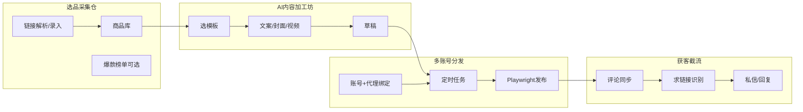

# 业务概览

## 业务背景

推广引流后台用于在小红书、抖音等平台进行选品、内容生产与多账号分发，并通过评论/私信截流获客。流程为：**选品采集 → AI 内容加工 → 多账号定时发布 → 评论监控与私信引导**。

- **选品**：支持粘贴淘宝/猫超等链接解析商品信息（首期可人工录入），以及爆款榜单（首期可不接联盟 API）。
- **内容**：基于 **Gemini 3 Flash** 与模板生成文案（支持多种羊毛风格如暴躁省钱风、闺蜜安利风、超市比价风），合成封面图，可选视频去重，形成可发布草稿。
- **分发**：绑定多个抖音、小红书账号，每账号独立 IP/代理，通过 Playwright-go 模拟登录定时发布。
- **截流**：汇总各账号评论，识别「求链接」等意图，通过私信或回复引导转化。

---

## 用户角色

| 角色 | 职责 |
|------|------|
| **运营** | 选品录入、维护模板与草稿、配置定时发布、处理评论与私信。 |
| **管理员** | 账号与代理/IP 绑定、系统配置、任务与发布记录查看。 |

---

## 核心流程

1. **选品**：运营粘贴链接或手动录入商品，维护商品库；可选同步爆款榜单（后续扩展）。
2. **加工**：从商品库选品，选择文案风格模板，由 **Gemini 3 Flash** 根据所选模板风格生成文案并可编辑，合成封面、处理视频，保存为草稿。
3. **发布**：为草稿创建发布任务，选择账号与计划时间；定时到达后，发布 Worker 按账号用各自代理/IP 启动 Playwright，模拟登录并发布。
4. **截流**：Worker 或定时任务拉取各账号评论入库，AI 标记「求链接」等；运营在 Inbox 中一键私信/回复引导。

---

## 关键约束

- **暂不对接淘宝联盟**：选品与爆款首期以手动录入或简单解析为主。
- **模拟登录**：抖音、小红书发布与登录均通过 Playwright-go 浏览器自动化，不依赖官方开放平台发布接口。
- **一账号一 IP**：每个平台账号绑定独立代理或出口 IP，发布与评论拉取均使用该账号对应 IP，降低封号风险。
- **AI 模型**：内容加工坊的文案生成、风格化洗稿由 **Gemini 3 Flash** 驱动。

---

## 鉴权与权限

- **首期**：可为**无登录、内网或 IP 白名单**访问管理后台，便于快速上线。
- **后续**：若加登录，采用 JWT 或 Session，与现有 realworld 的 middleware 一致；角色仅运营/管理员即可，无需细粒度权限表（可后续扩展）。

---

## 建议实现顺序

便于分阶段交付，建议按以下顺序实现：

1. **选品 + 内容**：模板/草稿 CRUD、Gemini 文案生成、封面合成（可选视频去重）。
2. **分发**：账号绑定（含 proxy）、发布任务创建/列表、Playwright-go Worker 发布。
3. **定时规则与自动创建任务**：xsh_publish_schedules 与 cron 联动，到点自动创建任务或仅由用户手动创建。
4. **评论同步与 Inbox**：SyncComments（Playwright 或 Worker）、want_link 识别、私信/回复。
