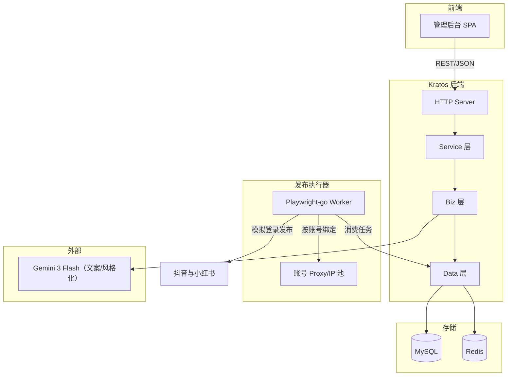
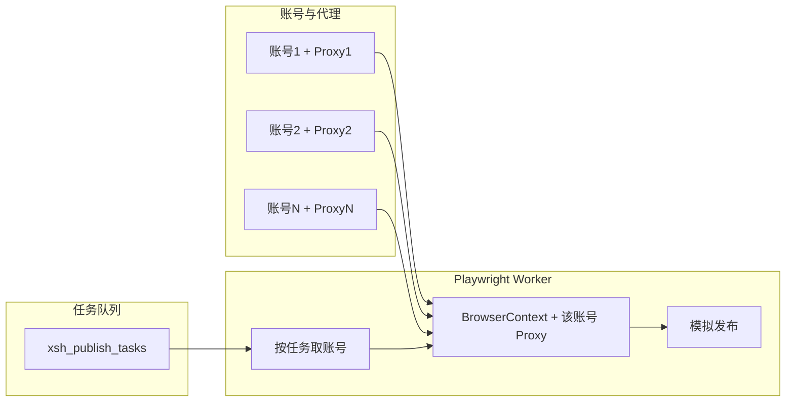

# 系统架构

## 整体架构图

- **前端**：管理后台 SPA（Vue 3），通过 HTTP 调用 Kratos 暴露的 REST API。
- **Kratos 后端**：在现有 realworld 项目中扩展，新增 xsh 相关 Service/Biz/Data，API 与数据表均带 `xsh_` 前缀。
- **发布执行器**：**Playwright-go Worker** 为独立进程（或与 Kratos 同进程内 goroutine），需独立配置文件或环境变量指向同一 MySQL；定时由系统 cron 或 Kratos 内定时触发「创建发布任务」或仅唤醒 Worker 拉取待执行任务。使用 **Playwright-go** 消费 `xsh_publish_tasks`，按**一账号一 IP** 从 `xsh_platform_accounts` 读取该账号的 proxy 配置，启动浏览器并完成抖音/小红书模拟登录与发布。
- **外部依赖**：仅 **Gemini 3 Flash**（内容加工坊文案等）；**暂不接淘宝联盟、不接抖音/小红书开放平台**，发布与登录均为模拟登录。

---

## 一账号一 IP 与发布执行器

- 每个平台账号在 `xsh_platform_accounts` 中绑定一条**独立代理**（或独立出口 IP）。
- 发布 Worker 执行任务时：根据任务中的 `account_id` 查出该账号的 proxy 配置，用该 proxy 启动/复用 Playwright 的 Browser 或 Context，再执行登录态下的发布流程，避免多账号同 IP 被封。

---

## 与现有 realworld 的集成方式

- **代码位置**：在 `realworld` 仓库内扩展，不新建独立服务。
  - `api/xsh/v1/`：xsh 相关 proto 与生成代码。
  - `internal/biz/`：新增 xsh 相关 Usecase（如 ProductUsecase、DraftUsecase、DispatchUsecase、InboxUsecase）。
  - `internal/data/`：新增 xsh 的 PO 与 Repo（如 `xsh_product.go`、`xsh_platform_account.go` 等），在 `data.go` 的 AutoMigrate 中注册新表。
  - `internal/service/`：新增 xsh 的 Service，在 `server/http.go` 中注册路由。
- **依赖注入**：在 `cmd/realworld/wire.go` 与 `wire_gen.go` 中增加 xsh 的 Provider 与 NewXXX 调用。
- **配置**：沿用现有 `configs/config.yaml` 与 `internal/conf`，可在 Data 或 Server 中增加 xsh 或 playwright 相关配置块（如默认超时、浏览器路径），及 **xsh.ai**（Gemini API Key、model）。

---

## 技术栈

| 层级 | 技术 |
|------|------|
| 前端 | Vue 3、Vue Router、Pinia、Element Plus 或 Naive UI、axios |
| 后端 | Go、Kratos v2、GORM、MySQL、Redis |
| 发布执行 | Playwright-go、Chromium（每账号独立 proxy） |
| 外部 | **Gemini 3 Flash**（文案生成等），暂不接淘宝联盟与平台开放 API |

---

## 合规与风险说明

- **当前不接淘宝联盟、不接抖音/小红书开放平台**，选品首期手动或简单解析，发布与登录均为 **Playwright-go 模拟登录**。
- 需注意各平台反自动化、账号风控与合规使用；**一账号一 IP** 为多账号场景下的防封基础要求，在 schema、部署与运维中均需落实。
