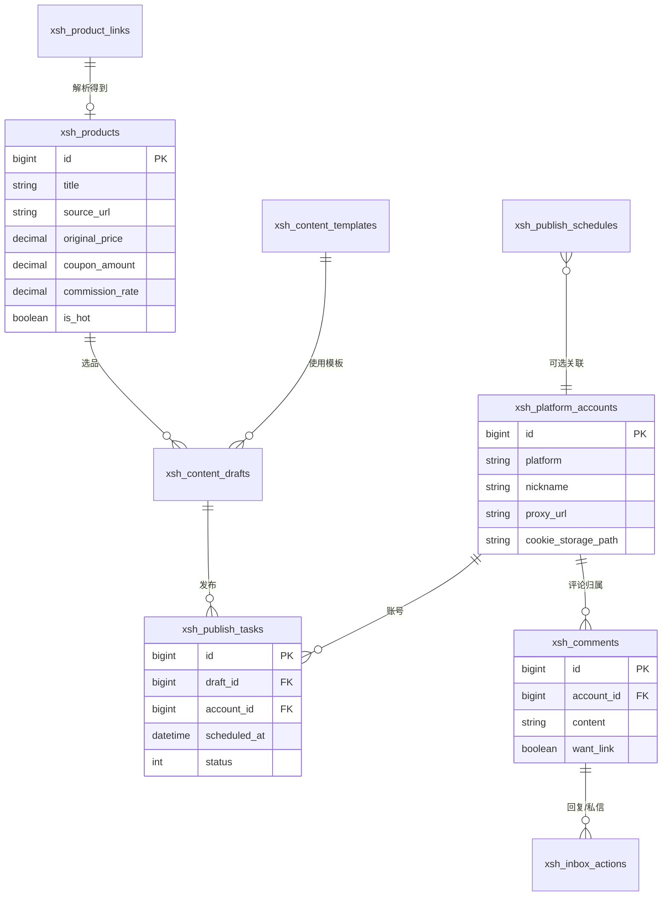

# 数据库设计总览

推广引流后台使用独立表名前缀 `xsh_`，可与现有 realworld 共用同一 MySQL 库（如 `kratos-blog`），或单独建库 `xsh_admin`（在 [migrations.md](migrations.md) 中二选一说明）。

---

## 表清单

| 模块 | 表名 | 说明 |
|------|------|------|
| 选品采集仓 | `xsh_products` | 解析后的商品信息 |
| 选品采集仓 | `xsh_hot_ranks` | 爆款榜单快照（可选） |
| 选品采集仓 | `xsh_product_links` | 原始链接与解析记录 |
| AI 加工坊 | `xsh_content_templates` | 文案模板 |
| AI 加工坊 | `xsh_content_drafts` | 内容草稿 |
| 分发矩阵 | `xsh_platform_accounts` | 平台账号（含代理/IP 配置，一账号一 IP） |
| 分发矩阵 | `xsh_publish_tasks` | 发布任务 |
| 分发矩阵 | `xsh_publish_schedules` | 定时发布规则 |
| 获客截流 | `xsh_comments` | 评论汇总 |
| 获客截流 | `xsh_inbox_actions` | 私信/回复动作记录 |

---

## ER 关系简图

详见 [schema.md](schema.md) 的完整字段与索引，以及 [migrations.md](migrations.md) 的迁移方式。
